# Pipeline Architecture
<!--  
```mermaid
flowchart LR
    subgraph Source["Azure SQL Database (sanjaydb)"]
        T["Customer_Transactions\n(table)"]
        V["Customer_Transactions_View"]
        W["WatermarkTable\n(TableName, WatermarkValue)"]
        T -> V
    end

    subgraph ADF["Azure Data Factory — p_ingestion_incremental"]
        L1["Lkp_get_old_watermark\n(Lookup WatermarkTable)"]
        L2["Lkp_get_new_watermark\n(Lookup MAX(LastModifiedDate)\nfrom view)"]
        CD["Copy delta_data\n(Copy Activity)"]
        SP["Stored procedure1\n(usp_write_watermark)"]
        L1 -> CD
        L2 -> CD
        CD -> SP
    end

    subgraph Sink["Azure Data Lake Storage Gen2"]
        P["Parquet output\n(analytics-ready)"]
    end

    W -.-> L1
    V -.-> L2
    V -- "delta rows between\nold & new watermark" -> CD
    CD -- P
    SP -.->|"writes new\nWatermarkValue"| W
```
-->

```mermaid
graph LR
    %% Global Styling
    classDef sqlStyle fill:#e0f2fe,stroke:#0284c7,stroke-width:2px,color:#0f172a;
    classDef adfStyle fill:#fef3c7,stroke:#d97706,stroke-width:2px,color:#0f172a;
    classDef dbxStyle fill:#fee2e2,stroke:#dc2626,stroke-width:2px,color:#0f172a;
    classDef adlsStyle fill:#dcfce7,stroke:#16a34a,stroke-width:2px,color:#0f172a;
    classDef biStyle fill:#f3e8ff,stroke:#9333ea,stroke-width:2px,color:#0f172a;
    classDef mgmtStyle fill:#f8fafc,stroke:#64748b,stroke-width:1.5px,color:#334155;

    %% Source System
    subgraph S1 ["Insurance Source (Azure SQL)"]
        direction TB
        T1["Customer_Transactions<br/><b>(1M+ Historical Rows)</b>"]:::sqlStyle
        V1["v_Customer_Transactions<br/><i>(Presentation View Layer)</i>"]:::sqlStyle
        W1["WatermarkTable<br/><i>(State Tracker: 2026-06-25)</i>"]:::sqlStyle
        SP1["usp_write_watermark<br/><i>(Stored Procedure)</i>"]:::sqlStyle
    end

    %% Orchestration Layer
    subgraph S2 ["Azure Data Factory (Orchestrator: sanjaynarayanan-df)"]
        direction TB
        subgraph Pipeline ["Pipeline: p_incremental_ingestion_metadata"]
            L1["Lookup(Old)<br/>Lkp_get_old_watermark"]:::adfStyle
            L2["Lookup(New)<br/>Lkp_get_new_watermark"]:::adfStyle
            CP["Copy Activity<br/><b>copy_delta_data</b><br/><i>(Dynamic SQL Extraction)</i>"]:::adfStyle
            SP_Act["Stored Procedure<br/><b>usp_write_watermark</b><br/><i>(@formatDateTime)</i>"]:::adfStyle
            DBX_Act["Databricks Notebook Activity<br/><i>(Trigger Medallion Jobs)</i>"]:::adfStyle
            
            L1 --> CP
            L2 --> CP
            CP -->|On Success| SP_Act
            SP_Act -->|On Success| DBX_Act
        end
    end

    %% Storage & Lakehouse
    subgraph S3 ["ADLS Gen2 Storage (sanjayazurestorage)"]
        direction TB
        B_Store[("landing/raw/<br/><b>Bronze Layer</b><br/><i>(Optimized .parquet)</i>")]:::adlsStyle
        S_Store[("delta/silver/<br/><b>Silver Layer</b><br/><i>(Cleansed Delta Tables)</i>")]:::adlsStyle
        G_Store[("delta/gold/<br/><b>Gold Layer</b><br/><i>(Star Schema Marts)</i>")]:::adlsStyle
    end

    %% Transformation Compute
    subgraph S4 ["Azure Databricks Workspace (PySpark Engine)"]
        direction TB
        NB1["01_Bronze_Ingestion<br/><i>Read Parquet / Schema Validation</i>"]:::dbxStyle
        NB2["02_Silver_Cleansing<br/><i>Deduplication, Audit Cols, Cast Types</i>"]:::dbxStyle
        NB3["03_Gold_Aggregations<br/><i>Risk & Monthly Premium Aggregates</i>"]:::dbxStyle
        
        NB1 --> NB2 --> NB3
    end

    %% Consumption Layer
    subgraph S5 ["Consumer & Analytics (Power BI)"]
        direction TB
        BI["Executive Insurance Dashboard<br/>• Monthly Premium Revenue<br/>• Risk Exposure by PolicyType<br/>• Customer Growth Metrics"]:::biStyle
    end

    %% Flow Numbering & Edges
    W1 -.->|1. Fetch Old Checkpoint| L1
    V1 -.->|1. Calculate Max Timestamp| L2
    V1 ==>|2. Stream Delta Batch 5 to 1M Rows| CP
    CP ==>|3. Sink Parquet Payload| B_Store
    SP_Act -.->|4. Atomic Checkpoint Commit| W1
    DBX_Act ==>|5. Trigger REST Jobs API| NB1
    B_Store <--> NB1
    NB2 ==> S_Store
    NB3 ==> G_Store
    G_Store ==>|6. DirectLake / Import| BI

    %% Infrastructure & Governance
    subgraph S6 ["Resource Group Management: rg-portfolio-de"]
        direction LR
        M1["Security & Networking:<br/>Azure Services Allowed"]:::mgmtStyle
        M2["Storage Config:<br/>Hierarchical Namespace (ADLS Gen2)<br/>Soft Delete Disabled"]:::mgmtStyle
        M3["CI/CD Governance:<br/>Git Integration (GitHub Main Repo)"]:::mgmtStyle
    end
```



## Flow Description

1. **`Lkp_get_old_watermark`** reads the last processed boundary from `WatermarkTable`.
2. **`Lkp_get_new_watermark`** calculates the current max `LastModifiedDate` from the view — this becomes the new upper boundary.
3. **`Copy delta_data`** pulls only rows between the old and new watermark from `Customer_Transactions_View` and writes them to ADLS Gen2 as Parquet.
4. **`Stored procedure1`** calls `usp_write_watermark` to persist the new watermark back into `WatermarkTable`, so the next run starts exactly where this one left off.

This closed-loop watermark pattern is what makes the pipeline incremental rather than a full reload every run.
