# Enterprise Metadata-Driven Incremental Ingestion Pipeline (ADF & Azure SQL)

## Project Overview
This repository contains a production-grade, end-to-end cloud data ingestion pipeline built using **Azure Data Factory (ADF)**, **Azure SQL Database**, and **Azure Data Lake Storage Gen2 (ADLS Gen2)**.

Instead of creating hardcoded, high-maintenance pipelines for individual tables, this project implements a scalable, **metadata-driven framework** that uses a dynamic watermark control loop and a database view abstraction layer to identify and capture delta changes (incremental/CDC-style logic) across an enterprise dataset scaled to **1,000,000+ records**.


## Architecture

```mermaid
graph LR
    %% Global Styling
    classDef sqlStyle fill:#e0f2fe,stroke:#0284c7,stroke-width:2px,color:#0f172a;
    classDef adfStyle fill:#fef3c7,stroke:#d97706,stroke-width:2px,color:#0f172a;
    classDef dbxStyle fill:#fee2e2,stroke:#dc2626,stroke-width:2px,color:#0f172a;
    classDef adlsStyle fill:#dcfce7,stroke:#16a34a,stroke-width:2px,color:#0f172a;
    classDef biStyle fill:#f3e8ff,stroke:#9333ea,stroke-width:2px,color:#0f172a;
    classDef mgmtStyle fill:#f8fafc,stroke:#64748b,stroke-width:1.5px,color:#334155;

    %% Source System
    subgraph S1 ["Insurance Source (Azure SQL)"]
        direction TB
        T1["Customer_Transactions<br/><b>(1M+ Historical Rows)</b>"]:::sqlStyle
        V1["v_Customer_Transactions<br/><i>(Presentation View Layer)</i>"]:::sqlStyle
        W1["WatermarkTable<br/><i>(State Tracker: 2026-06-25)</i>"]:::sqlStyle
        SP1["usp_write_watermark<br/><i>(Stored Procedure)</i>"]:::sqlStyle
    end

    %% Orchestration Layer
    subgraph S2 ["Azure Data Factory (Orchestrator: sanjaynarayanan-df)"]
        direction TB
        subgraph Pipeline ["Pipeline: p_incremental_ingestion_metadata"]
            L1["Lookup(Old)<br/>Lkp_get_old_watermark"]:::adfStyle
            L2["Lookup(New)<br/>Lkp_get_new_watermark"]:::adfStyle
            CP["Copy Activity<br/><b>copy_delta_data</b><br/><i>(Dynamic SQL Extraction)</i>"]:::adfStyle
            SP_Act["Stored Procedure<br/><b>usp_write_watermark</b><br/><i>(@formatDateTime)</i>"]:::adfStyle
            DBX_Act["Databricks Notebook Activity<br/><i>(Trigger Medallion Jobs)</i>"]:::adfStyle
            
            L1 --> CP
            L2 --> CP
            CP -->|On Success| SP_Act
            SP_Act -->|On Success| DBX_Act
        end
    end

    %% Storage & Lakehouse
    subgraph S3 ["ADLS Gen2 Storage (sanjayazurestorage)"]
        direction TB
        B_Store[("landing/raw/<br/><b>Bronze Layer</b><br/><i>(Optimized .parquet)</i>")]:::adlsStyle
        S_Store[("delta/silver/<br/><b>Silver Layer</b><br/><i>(Cleansed Delta Tables)</i>")]:::adlsStyle
        G_Store[("delta/gold/<br/><b>Gold Layer</b><br/><i>(Star Schema Marts)</i>")]:::adlsStyle
    end

    %% Transformation Compute
    subgraph S4 ["Azure Databricks Workspace (PySpark Engine)"]
        direction TB
        NB1["01_Bronze_Ingestion<br/><i>Read Parquet / Schema Validation</i>"]:::dbxStyle
        NB2["02_Silver_Cleansing<br/><i>Deduplication, Audit Cols, Cast Types</i>"]:::dbxStyle
        NB3["03_Gold_Aggregations<br/><i>Risk & Monthly Premium Aggregates</i>"]:::dbxStyle
        
        NB1 --> NB2 --> NB3
    end

    %% Consumption Layer
    subgraph S5 ["Consumer & Analytics (Power BI)"]
        direction TB
        BI["Executive Insurance Dashboard<br/>• Monthly Premium Revenue<br/>• Risk Exposure by PolicyType<br/>• Customer Growth Metrics"]:::biStyle
    end

    %% Flow Numbering & Edges
    W1 -.->|1. Fetch Old Checkpoint| L1
    V1 -.->|1. Calculate Max Timestamp| L2
    V1 ==>|2. Stream Delta Batch 5 to 1M Rows| CP
    CP ==>|3. Sink Parquet Payload| B_Store
    SP_Act -.->|4. Atomic Checkpoint Commit| W1
    DBX_Act ==>|5. Trigger REST Jobs API| NB1
    B_Store <--> NB1
    NB2 ==> S_Store
    NB3 ==> G_Store
    G_Store ==>|6. DirectLake / Import| BI

    %% Infrastructure & Governance
    subgraph S6 ["Resource Group Management: rg-portfolio-de"]
        direction LR
        M1["Security & Networking:<br/>Azure Services Allowed"]:::mgmtStyle
        M2["Storage Config:<br/>Hierarchical Namespace (ADLS Gen2)<br/>Soft Delete Disabled"]:::mgmtStyle
        M3["CI/CD Governance:<br/>Git Integration (GitHub Main Repo)"]:::mgmtStyle
    end
```


---

## Key Technical Achievements & Architecture
- **High Volume Scalability:** Built and validated the ingestion logic against a synthetic insurance transactions dataset scaled to over **1,000,000 rows**, confirmed via pipeline monitoring (75.245 MB read, 1,000,006 rows read/written in a single run).
- **Metadata-Driven Framework:** Orchestrated the pipeline using a centralized SQL control table (`WatermarkTable`) that tracks the last successfully processed extraction boundary per source table — no hardcoded date filters.
- **Database View Abstraction Layer:** Implemented a presentation-layer view (`Customer_Transactions_View`) to decouple the ADF orchestration layer from the underlying table schema, improving security and query performance.
- **Self-Updating Watermark:** After every successful load, a stored procedure (`usp_write_watermark`) writes the new high-watermark value back to the control table, so the next run automatically picks up only new/changed rows.
- **Optimized Columnar Storage:** Sink layer writes the delta output directly into compressed, analytics-ready `.parquet` format in ADLS Gen2 (23.071 MB written from 75.245 MB source — ~69% compression).
- **Validated Incrementality:** Manually inserted a new test row into the source table and re-ran the pipeline to confirm only the new record was picked up on the next incremental run.

---

## Data Architecture & Pipeline Flow

**Pipeline: `p_ingestion_incremental`**

1. **`Lkp_get_old_watermark`** (Lookup) — queries `WatermarkTable` to fetch the last successfully processed timestamp boundary (`WatermarkValue`) for `Customer_Transactions`.
2. **`Lkp_get_new_watermark`** (Lookup) — runs `SELECT MAX(LastModifiedDate) AS NewWatermarkValue FROM Customer_Transactions_View` to calculate the current upper boundary for this run.
3. **`Copy delta_data`** (Copy Data) — dynamically filters and copies only the delta rows using the two watermark values, writing the output as Parquet into ADLS Gen2:
   ```sql
   SELECT * FROM Customer_Transactions_View
   WHERE LastModifiedDate > '@{activity('Lkp_get_old_watermark').output.firstRow.WatermarkValue}'
   AND LastModifiedDate <= '@{activity('Lkp_get_new_watermark').output.firstRow.NewWatermarkValue}'
   ```
4. **`Stored procedure1`** (`usp_write_watermark`) — writes the new watermark value back to `WatermarkTable`, using `@LastModifiedDate` and `@TableName` as input parameters, closing the loop for the next run.

**Source → Sink:** Azure SQL Database (`sanjaydb`) → Azure Data Lake Storage Gen2 (Parquet)

---

## Repository Structure
```
├── architecture/          # Pipeline flow diagram(s)
├── azure-data-factory/    # ADF pipeline JSON / exported definitions
├── sql/                   # WatermarkTable DDL, Customer_Transactions_View, usp_write_watermark
├── screenshots/           # Pipeline canvas, monitoring runs, SQL query editor, linked services
├── docs/                  # Additional notes
├── LICENSE
└── README.md
```

---

## Tech Stack
| Layer | Service |
|---|---|
| Orchestration | Azure Data Factory |
| Source | Azure SQL Database |
| Sink | Azure Data Lake Storage Gen2 (Parquet) |
| Control table | Azure SQL (`WatermarkTable`) |
| Linked services configured | 3× ADLS Gen2, 1× Azure SQL Database, 1× Azure Databricks (Delta Lake) — set up for a future Databricks transformation layer |

---

## Testing & Validation
- Ran the pipeline in Debug mode; all four activities (`Lkp_get_old_watermark`, `Lkp_get_new_watermark`, `Copy delta_data`, `Stored procedure1`) succeeded.
- Verified copy activity performance via ADF's monitoring "Details" view:
  - Rows read/written: 1,000,006
  - Data read: 75.245 MB → Data written: 23.071 MB
  - Copy duration: 22s, Throughput: 5.788 MB/s
- Manually inserted a new row into `Customer_Transactions` via the Azure SQL Query editor and confirmed the next pipeline run picked it up as a new delta, proving the watermark logic works end-to-end.

---

## Future Enhancements
- Add a Databricks transformation activity (linked service already provisioned) between Copy Data and the sink for cleansing/enrichment before landing in ADLS Gen2.
- Parameterize the pipeline to loop over multiple source tables using the same watermark framework (ForEach + Lookup on a table-list config).
- Add Power BI reporting on top of the Parquet output for business-facing insights.

---

## Author
Sanjay Narayanan — Data Load Member, MDM/ETL background (Informatica PowerCenter, IICS/IDMC), transitioning into cloud data engineering.